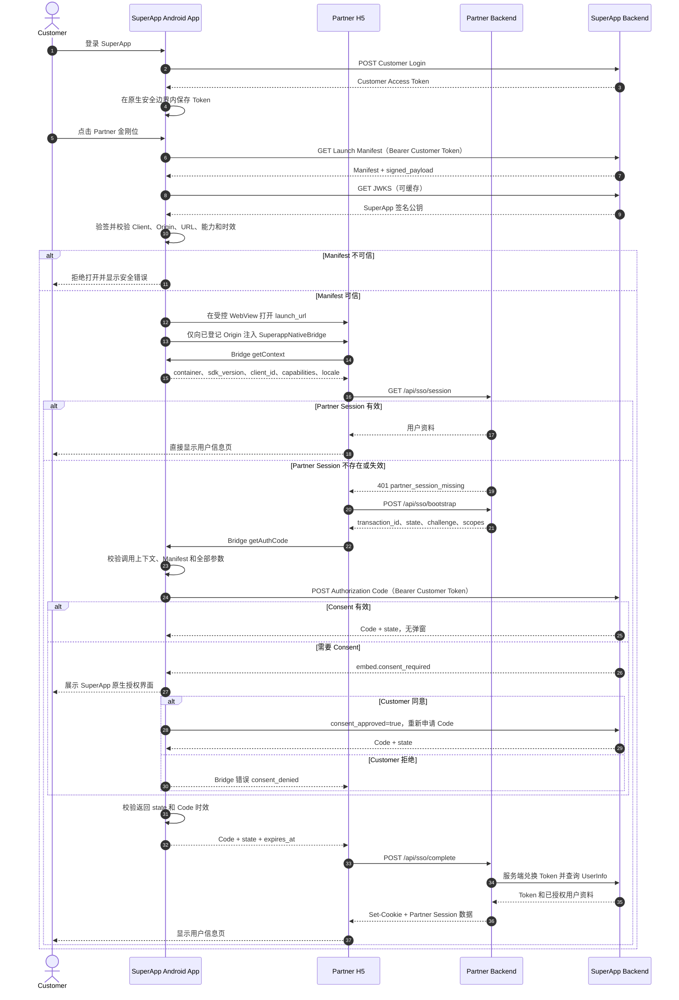

# SuperApp Embed SSO Android 接入指南

本文面向 SuperApp Android 客户端团队，说明 Android App 在 Embed SSO 中需要实现的能力、
接口、Native Bridge、安全校验和验收标准。

本文中的 Android App 指 **SuperApp 原生客户端**，不是 Partner 自己的 Android App。完整的
Partner 无 SDK 接入方式见
[`SuperApp Embed SSO 三方接入指南（无 SDK 版）`](superapp-embed-sso-partner-integration-no-sdk.md)。

## 1. 接入目标

用户应能完成以下流程：

1. 使用 Customer 账号登录 SuperApp；
2. 点击 Partner 金刚位；
3. SuperApp 安全打开 Partner H5；
4. 首次申请资料时展示 SuperApp 原生授权界面；
5. Customer 同意后，Partner H5 展示昵称、头像等已授权资料；
6. Partner Session 有效时再次打开，直接显示用户信息页；
7. Partner Session 丢失但 SuperApp Consent 有效时，静默签发新的 Authorization Code；
8. Customer 撤销 Consent 后，下次进入必须重新授权。

Android App 负责 Customer 身份和可信容器，不负责 Partner 的 OAuth 服务端流程。

## 2. 系统角色与边界

| 角色 | 主要职责 |
| --- | --- |
| SuperApp Android App | 登录 Customer、获取并验签 Launch Manifest、创建受控 WebView、注入 Native Bridge、展示原生 Consent、携带 Customer Token 申请 Authorization Code、管理和撤销 Consent |
| SuperApp Backend | 管理 Embed Client 和 Consent，签发 Launch Manifest、Authorization Code、Access Token 和 Refresh Token，提供 UserInfo 等接口 |
| Partner H5 | 检查 Partner Session，创建 SSO 事务，调用 Native Bridge 获取 Code，把 Code 交给 Partner Backend，展示用户信息 |
| Partner Backend | 保存 `state` 和 PKCE verifier，兑换及刷新 Token，查询 UserInfo，建立 Partner Session |

Android App 必须遵守以下边界：

- Customer Token 只能存在于 SuperApp 原生层；
- `SuperappNativeBridge` 只能由 SuperApp 原生客户端注入；
- Partner 私钥、PKCE `code_verifier`、Partner Access Token 和 Refresh Token 不进入 App；
- Android App 不调用 Token Endpoint、Refresh Endpoint 或 UserInfo Endpoint；
- Android App 不判断 Partner Session 是否有效；
- H5 只能获得短期一次性的 Authorization Code，不能获得 Customer Token。

## 3. Android 侧完整时序图



## 4. 接入前准备

Android 团队需要从 SuperApp Backend 团队获得：

1. 测试和生产环境的 API Base URL；
2. Launch Manifest 的 `issuer`；
3. JWKS URL；
4. Embed Client ID；
5. Customer 登录及 Token 生命周期契约；
6. Launch Manifest、Authorization Code 和 Consent API 契约；
7. 稳定错误码清单；
8. Customer 测试账号及已登记的 Partner 测试环境。

测试配置示例：

```text
SUPERAPP_BASE_URL = http://localhost:8080
EMBED_ISSUER = http://localhost:8080
EMBED_JWKS_URL = http://localhost:8080/.well-known/jwks.json
EMBED_CLIENT_ID = embcli_xxx
```

生产环境的 API、Issuer、JWKS 和 Partner H5 必须使用 HTTPS。测试包可以为本地联调单独放开
`localhost` 明文流量，但 release 包不应继承该配置。

## 5. Customer 登录与 Token 管理

### 5.1 登录

Android App 调用 SuperApp Customer 登录接口：

```http
POST /api/customer/v1/auth/login
Content-Type: application/json
Accept: application/json, application/problem+json
```

示例请求：

```json
{
  "identifier": "+60123456789",
  "password": "********",
  "device_id": "android-device-id",
  "device_name": "Android Device"
}
```

App 保存返回的 Customer Access Token 及过期时间。Demo 只保存在进程内存；生产实现应按
SuperApp 自身的登录策略使用系统安全存储、Token 刷新和设备绑定能力。

### 5.2 Token 安全要求

- 不把 Customer Token 注入 H5；
- 不把 Customer Token 拼接到 URL、Intent Extra 或 Deep Link；
- 不写入普通 SharedPreferences、日志、崩溃报告或埋点；
- Token 过期时停止授权流程并进入 SuperApp 重新登录或刷新流程；
- Customer 退出登录时关闭 Partner WebView，并清理相关运行态数据。

## 6. 点击金刚位与 Launch Manifest

### 6.1 获取 Manifest

用户点击 Partner 金刚位后，App 调用：

```http
GET /api/customer/v1/embed/apps/{client_id}/launch-manifest
Authorization: Bearer <customer-token>
Accept: application/json, application/problem+json
```

返回示例：

```json
{
  "launch_id": "launch_xxx",
  "client_id": "embcli_xxx",
  "display_name": "Partner H5",
  "origin": "https://partner.example.com",
  "launch_url": "https://partner.example.com/app",
  "capabilities": [
    "getAuthCode",
    "openPrivacySettings",
    "close"
  ],
  "expires_at": "2026-08-20T08:00:30Z",
  "signed_payload": "<compact-jws>"
}
```

Android App 不应在 APK 中写死 Partner H5 URL，也不能绕过 Manifest 直接打开后台配置之外的
URL。

### 6.2 验签与字段校验

App 从 JWKS URL 获取签名公钥，并至少完成以下校验：

1. `signed_payload` 是三段 Compact JWS；
2. JWS `alg` 必须是允许的算法，例如 `ES256`；
3. `kid` 非空，且在 JWKS 中唯一匹配；
4. JWK 必须为 `kty=EC`、`crv=P-256`、`use=sig`、`alg=ES256`；
5. JWK 不得包含私钥字段 `d`；
6. JWS 签名有效；
7. `iss` 等于配置的 SuperApp Issuer；
8. `sub` 等于外层 `launch_id`；
9. `aud` 唯一且等于 `client_id`；
10. `client_id` 等于用户点击的金刚位 Client ID；
11. 签名内外层的 `display_name`、`origin`、`launch_url`、`capabilities` 完全一致；
12. `iat` 不在不可接受的未来时间；
13. `exp` 和外层 `expires_at` 一致且均未过期；
14. `origin` 是不带 Path、Query、Fragment 或 UserInfo 的精确 HTTPS Origin；
15. `launch_url` 使用 HTTPS，且其标准化 Origin 与 `origin` 完全相同；
16. `capabilities` 非空且没有重复项。

遇到未知 `kid` 时，可以强制刷新一次 JWKS 后重试；仍然失败必须拒绝打开。不得在验签失败时
降级为直接信任外层字段。

## 7. 受控 WebView

Manifest 验证成功后，App 才能创建 WebView。建议把 `launch_id` 作为普通启动上下文附加到
`launch_url`：

```text
https://partner.example.com/app?launch_id=launch_xxx
```

`launch_id` 不是 Customer Token，也不能替代 Manifest 验签。

WebView 必须满足：

- 只允许受信 Origin 的主文档使用 Bridge；
- Bridge 使用精确 Origin 白名单，不使用 `*`；
- Bridge 只接受主 Frame 请求；
- 主文档导航期间禁用状态变更能力；
- 非受信主文档不能继续复用 Bridge；
- 禁止 File 和 Content URL 访问；
- 禁止 Mixed Content；
- 禁止忽略 TLS 证书错误；
- 非受信主导航应阻止或交给系统浏览器处理；
- WebView 关闭时取消协程/请求、移除视图并销毁实例；
- release 包关闭 WebView 调试能力。

## 8. Native Bridge 通用协议

Android App 在受信页面的 document-start 阶段提供：

```js
globalThis.SuperappNativeBridge.invoke(method, params)
```

H5 发给原生层的消息格式：

```json
{
  "request_id": "random-request-id",
  "method": "getContext",
  "params": {}
}
```

成功响应：

```json
{
  "request_id": "random-request-id",
  "ok": true,
  "result": {}
}
```

失败响应：

```json
{
  "request_id": "random-request-id",
  "ok": false,
  "error": {
    "code": "stable_error_code",
    "message": "Safe message"
  }
}
```

实现要求：

- `request_id` 必须随机、格式受限并与响应一一对应；
- 每个调用设置超时，并在完成后删除 pending callback；
- Bridge 对象应不可被页面覆盖或修改；
- 未登记在 Manifest `capabilities` 中的方法返回 `capability_denied`；
- 未知方法返回 `method_not_found`；
- 不把堆栈、Token、内部 URL 或后端响应原文返回 H5。

## 9. `getContext`

H5 调用：

```js
await SuperappNativeBridge.invoke("getContext", {});
```

Android App 返回：

```json
{
  "sdk_version": "1.0",
  "client_id": "embcli_xxx",
  "container": "superapp",
  "capabilities": [
    "getAuthCode",
    "openPrivacySettings",
    "close"
  ],
  "locale": "zh-CN"
}
```

`getContext` 只返回非敏感容器信息，不能包含 Customer Token、Customer ID、手机号或其他用户
资料。H5 会用它确认当前页面处于正确的 SuperApp 容器和 Embed Client 中。

## 10. `getAuthCode`

### 10.1 Bridge 请求

Partner H5 调用：

```js
await SuperappNativeBridge.invoke("getAuthCode", {
  transaction_id: "ptx_xxx",
  client_id: "embcli_xxx",
  scopes: ["auth_base", "profile.name", "profile.avatar"],
  state: "base64url-random-state",
  code_challenge: "base64url-sha256-challenge",
  code_challenge_method: "S256"
});
```

其中 `transaction_id`、`state` 和 PKCE challenge 由 Partner Backend 生成。Android App 不生成、
保存或获取 `code_verifier`。

### 10.2 Android 本地校验

收到调用后，App 必须校验：

1. 消息来自 Manifest Origin 的受信主文档；
2. 页面当前没有导航、关闭或被替换；
3. App 位于前台，设备未锁定；
4. Manifest 仍在有效期内；
5. Manifest 包含 `getAuthCode` capability；
6. `client_id` 与 Manifest 完全一致；
7. `transaction_id` 非空且长度受限；
8. `state` 使用允许字符、长度受限并具有足够随机性；
9. `code_challenge_method` 只能是 `S256`；
10. `code_challenge` 是 43 字符 Base64URL，解码后为 32 字节；
11. Scope 非空、无重复且属于 App 已知的 Scope；Client 级允许范围由 SuperApp Backend 再次
    权威校验；
12. 同一 WebView 同一时间只能有一个授权请求。

校验失败不得调用 SuperApp Backend，也不得展示 Consent。

### 10.3 申请 Authorization Code

校验成功后，Android App 携带 Customer Token 调用：

```http
POST /api/customer/v1/embed/authorization-codes
Authorization: Bearer <customer-token>
Content-Type: application/json
Accept: application/json, application/problem+json
```

第一次请求示例：

```json
{
  "client_id": "embcli_xxx",
  "launch_id": "launch_xxx",
  "origin": "https://partner.example.com",
  "scopes": ["auth_base", "profile.name", "profile.avatar"],
  "code_challenge": "base64url-sha256-challenge",
  "code_challenge_method": "S256",
  "state": "base64url-random-state",
  "consent_approved": false
}
```

注意：Bridge 请求中的 `transaction_id` 属于 Partner SSO 事务，当前 SuperApp 创建 Code 接口
不接收该字段。Partner H5 会在调用 `/api/sso/complete` 时把 `transaction_id` 与 Code 一起交给
Partner Backend。

### 10.4 Consent 分支

如果 SuperApp Backend 直接返回 Code，说明 Consent 已存在且有效。App 不显示授权界面，直接
把 Code 返回 H5。

如果返回稳定错误码：

```text
embed.consent_required
```

Android App 必须展示 SuperApp 原生 Consent 界面，至少包含：

- 可信 Manifest 中的 Partner 名称；
- 本次申请的 Scope 及用户可理解的资料说明；
- Partner 隐私政策入口；
- 明确的同意和拒绝操作。

Partner H5 不能自行伪造该原生 Consent，也不能使用网页弹窗代替。

Customer 同意后，App 重新调用创建 Code 接口，并设置：

```json
{
  "consent_approved": true
}
```

Customer 拒绝后，App 不再调用创建 Code 接口，通过 Bridge 返回：

```json
{
  "code": "consent_denied",
  "message": "User declined authorization"
}
```

### 10.5 成功响应

SuperApp Backend 返回：

```json
{
  "code": "one-time-authorization-code",
  "state": "base64url-random-state",
  "expires_at": "2026-08-20T08:00:30Z"
}
```

Android App 在返回 H5 前必须再次检查：

- 返回的 `state` 与 Bridge 请求完全一致；
- `expires_at` 仍在未来；
- WebView 仍是受信主文档；
- App 仍在前台且设备未锁定。

Bridge 成功结果只包含：

```json
{
  "code": "one-time-authorization-code",
  "state": "base64url-random-state",
  "expires_at": "2026-08-20T08:00:30Z"
}
```

Authorization Code 不得写入 URL、Cookie、LocalStorage、日志、崩溃报告或埋点。Android App
不兑换 Code，也不读取 Code 对应的 UserInfo。

## 11. 再次打开与静默 SSO

再次打开 Partner H5 时，Android App 仍然要获取并验签新的短期 Launch Manifest，不能复用
上一次已经过期的 Manifest。

随后存在两层状态：

1. **Partner Session 有效**：H5 直接从 Partner Backend 读取用户资料，不调用
   `getAuthCode`，Android App 不显示授权界面；
2. **Partner Session 不存在，但 SuperApp Consent 有效**：H5 重新调用 `getAuthCode`，
   SuperApp Backend 静默签发 Code，Android App 不显示授权界面；
3. **Consent 不存在、已撤销、已过期、版本变化或新增 Scope**：Android App 显示原生
   Consent。

Android App 不保存“Partner 已登录”标记，也不使用 LocalStorage 决定是否静默。Partner
Session 由 Partner Backend 管理，Consent 由 SuperApp Backend 管理。

## 12. `openPrivacySettings` 与撤销授权

H5 调用：

```js
await SuperappNativeBridge.invoke("openPrivacySettings", {});
```

Android App 打开 SuperApp 原生授权管理页面，并调用：

```http
GET /api/customer/v1/embed/authorizations
Authorization: Bearer <customer-token>
Accept: application/json, application/problem+json
```

页面应展示 Partner 名称、已授权 Scope、授权时间、过期时间和隐私政策入口。

Customer 撤销某个 Partner 的授权时调用：

```http
DELETE /api/customer/v1/embed/authorizations/{client_id}
Authorization: Bearer <customer-token>
Accept: application/json, application/problem+json
```

撤销成功后，Android App 应：

1. 刷新原生授权列表；
2. 关闭该 Partner 正在运行的 WebView；
3. 清理该 Partner 的 Cookie、Web Storage 和运行态页面数据；
4. 不在本地继续显示“已授权”；
5. 下次打开时重新走 Launch Manifest 和授权流程。

SuperApp Backend 负责让相应 Partner Token 失效；Partner Backend 在下次 Refresh 或 UserInfo
校验时清理 Partner Session。

## 13. `close`

H5 调用：

```js
await SuperappNativeBridge.invoke("close", {});
```

Android App 返回 Bridge 成功响应后，关闭当前 Partner 容器并回到 SuperApp 首页。关闭时需要
取消进行中的授权、拒绝未完成的 Consent、停止 WebView 加载并销毁 Bridge。

H5 只能关闭自己的容器，不能关闭整个 SuperApp 进程或操作其他页面。

## 14. Android 错误处理

### 14.1 Bridge 稳定错误码

| 错误码 | 场景 | Android 行为 |
| --- | --- | --- |
| `invalid_request` | JSON、`request_id` 或参数格式错误 | 拒绝请求，不访问后端 |
| `untrusted_context` | 非受信 Origin、非主 Frame 或页面已关闭 | 拒绝请求并记录脱敏安全事件 |
| `navigation_in_progress` | 页面正在导航 | 拒绝状态变更调用，H5 可稍后重试 |
| `capability_denied` | Manifest 未授予该能力 | 拒绝调用 |
| `method_not_found` | 未知 Bridge 方法 | 拒绝调用 |
| `authorization_in_progress` | 已有授权请求进行中 | 拒绝重复请求 |
| `consent_denied` | Customer 拒绝授权 | 返回 H5，不创建 Code |
| `authorization_failed` | 本地校验、生命周期或未知错误 | 返回通用错误，不泄漏内部细节 |

SuperApp Backend 返回的稳定 Embed 错误码可按以下方式处理：

| 上游错误码 | Android 行为 |
| --- | --- |
| `embed.consent_required` | 展示原生 Consent，用户同意后重新申请一次 |
| `embed.client_unavailable` | 关闭 Partner 容器或留在首页，提示暂不可用 |
| `embed.origin_not_allowed` | 终止流程，按安全错误处理 |
| `embed.launch_invalid` | 终止当前 Launch，要求重新点击金刚位 |
| `embed.scope_not_allowed` | 终止授权，提示 Partner 配置异常 |
| `identity.invalid_token` 或 HTTP 401 | 清理 Customer Session，进入重新登录/刷新流程 |
| 网络错误或 HTTP 5xx | 展示可重试提示，不能绕过校验或改用 H5 获取 Customer Token |

所有网络调用应设置连接和读取超时、响应大小限制，并禁止自动跟随到非预期 Host 的重定向。

## 15. 生命周期与并发

Android App 需要处理：

- App 切到后台时不继续创建 Authorization Code；
- 设备锁屏时不继续授权；
- WebView 导航、关闭或销毁时取消在途授权；
- Manifest 在等待 Consent 期间过期时终止流程；
- Consent 弹窗同一时间只存在一个；
- 快速重复点击只产生一个授权请求；
- Activity 重建时不能重复提交 `consent_approved=true`；
- 网络返回后再次确认当前页面、Origin 和生命周期仍可信；
- Customer Token 过期或退出登录时立刻终止当前 Bridge 请求。

## 16. 本地联调网络说明

Android 模拟器中的 `localhost` 指向模拟器自身。SuperApp Backend 在宿主机 `8080` 端口时，
每次启动模拟器后执行：

```bash
adb reverse tcp:8080 tcp:8080
adb reverse --list
```

如果模拟器需要使用宿主机代理访问公网 Partner H5/ngrok，应确保原生 SuperApp API 直连
`localhost:8080`，WebView 公网流量再使用系统代理。不要让 Customer 登录、Launch Manifest
或 Authorization Code 请求意外经过公网代理。

当前 Demo 的原生 API 使用 `Proxy.NO_PROXY` 显式直连，避免模拟器忽略系统代理排除列表后
返回 HTTP 502。

## 17. 安全要求汇总

- [ ] Customer Token 从未进入 H5、URL、Cookie、日志或埋点；
- [ ] Manifest 验签失败时绝不打开 Partner H5；
- [ ] 未知 `kid` 仅允许刷新 JWKS 后重试一次；
- [ ] 只向 Manifest 的精确 HTTPS Origin 注入 Bridge；
- [ ] Bridge 只接受受信主 Frame 消息；
- [ ] 非受信导航、TLS 错误、后台、锁屏和过期 Manifest 会终止授权；
- [ ] PKCE 只接受 `S256`；
- [ ] Scope 必须非空、去重并属于 Client 允许范围；
- [ ] 同一时间只允许一个授权请求；
- [ ] Consent 只能由 SuperApp 原生界面展示；
- [ ] Code 和 `state` 返回前再次校验；
- [ ] Code 不进入 URL、LocalStorage、日志或埋点；
- [ ] 撤销 Consent 后清理 Partner WebView 数据；
- [ ] release 包禁止明文流量并关闭 WebView 调试；
- [ ] Android App 不持有 Partner 私钥、verifier 或 Partner Token。

## 18. 联调验收清单

### 18.1 正常流程

- [ ] Customer 能登录 SuperApp；
- [ ] 点击金刚位后能获取并验签 Manifest；
- [ ] 可信 Partner H5 能调用 `getContext`；
- [ ] 首次申请资料显示 SuperApp 原生 Consent；
- [ ] Customer 同意后 H5 显示与 Scope 一致的用户资料；
- [ ] Customer 拒绝后 H5 收到 `consent_denied`；
- [ ] Partner Session 有效时再次打开直接显示用户信息页；
- [ ] Partner Session 丢失但 Consent 有效时静默获得 Code；
- [ ] `openPrivacySettings` 能查看并撤销 Partner Consent；
- [ ] 撤销后再次进入必须重新授权；
- [ ] `close` 能销毁当前 H5 并回到 SuperApp 首页。

### 18.2 安全与异常流程

- [ ] 修改 Manifest 任一外层字段后验签失败；
- [ ] 使用未知或错误 `kid` 时拒绝打开；
- [ ] Manifest 过期时拒绝打开或授权；
- [ ] HTTP 或非登记 Origin 无法使用 Bridge；
- [ ] iframe 无法调用敏感 Bridge 方法；
- [ ] 修改 `client_id`、`state`、challenge、method 或 Scope 后请求失败；
- [ ] 快速重复调用 `getAuthCode` 只允许一笔进行；
- [ ] App 进入后台或锁屏后授权失败；
- [ ] TLS 错误不会被忽略；
- [ ] Customer Token 过期后要求重新登录或刷新；
- [ ] 网络 5xx 不会触发绕过验签或网页降级授权；
- [ ] 日志、URL、Cookie、LocalStorage 和埋点中不存在敏感 Token 或 Code。

## 19. 当前 Demo 代码映射

| 能力 | 实现文件 |
| --- | --- |
| Customer 登录、金刚位、Consent 和授权管理页面状态 | `superapp-android/app/src/main/java/com/jiguangliandong/superapp/embeddemo/MainViewModel.kt` |
| SuperApp Customer、Launch、Code 和 Consent HTTP API | `superapp-android/app/src/main/java/com/jiguangliandong/superapp/embeddemo/data/SuperappApi.kt` |
| Launch Manifest ES256/JWKS 验证 | `superapp-android/app/src/main/java/com/jiguangliandong/superapp/embeddemo/security/LaunchManifestVerifier.kt` |
| Bridge Context 和 `getAuthCode` 参数校验 | `superapp-android/app/src/main/java/com/jiguangliandong/superapp/embeddemo/web/BridgeProtocol.kt` |
| 受控 WebView、Bridge 注入和授权编排 | `superapp-android/app/src/main/java/com/jiguangliandong/superapp/embeddemo/web/PartnerWebView.kt` |

Android 团队可以使用当前 Demo 作为协议参考，但生产实现仍需接入 SuperApp 正式的账号安全、
Token 生命周期、安全存储、网络证书策略、监控和发布流程。
