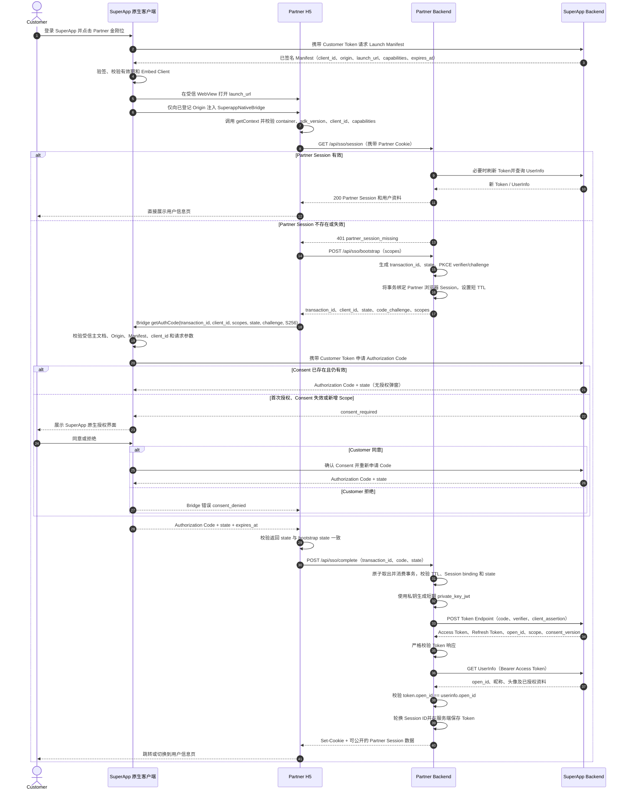

# SuperApp Embed SSO 三方接入指南（无 SDK 版）

> 文档版本：1.0<br>
> 更新时间：2026-08-19<br>
> 适用对象：Partner H5、Partner Backend、SuperApp 联调与安全团队

## 1. SDK 提供什么能力，不使用时需要实现什么

SuperApp 提供的 JavaScript SDK 和服务端 SDK 都是对协议流程的封装，目的是减少 Partner
重复实现及安全错误。它们不是 SSO 协议的强制组成部分，Partner 可以只使用其中一个，也可以
两个都不使用。

四种组合都可以正常接入：

| Partner H5 | Partner Backend | 是否支持 |
| --- | --- | --- |
| 使用 JavaScript SDK | 使用服务端 SDK | 支持，接入工作量最小 |
| 使用 JavaScript SDK | 自行实现服务端协议 | 支持 |
| 直接调用 Native Bridge | 使用服务端 SDK | 支持 |
| 直接调用 Native Bridge | 自行实现服务端协议 | 支持，即本文描述的无 SDK 方式 |

不使用 SuperApp SDK 后，Partner 仍然可以使用成熟的通用组件，例如 JWT/JWS、HTTP、加密、
Redis 和 Web Session 库。Partner 需要自行实现的是 SuperApp Embed SSO 的协议编排及安全约束，
而不是从零实现密码学算法。

### 1.1 JavaScript SDK 提供的能力

JavaScript SDK 运行在 Partner H5 中，主要负责封装 H5、Partner Backend 和
`SuperappNativeBridge` 之间的调用：

| SDK 能力 | 具体作用 |
| --- | --- |
| Bridge 可用性检查 | 检查当前页面是否运行在 SuperApp 注入 Bridge 的受信 WebView 中 |
| `getContext` | 获取容器版本、Client ID、Locale 和可用能力 |
| `getAuthCode` | 按 Bridge 契约提交 transaction、Scope、`state` 和 PKCE challenge |
| `authenticate` 流程编排 | 依次调用 Partner `/bootstrap`、Native Bridge 和 Partner `/complete` |
| `state` 初步校验 | 检查 Native Bridge 返回的 `state` 是否等于 bootstrap 中的值 |
| 超时与错误封装 | 将 Bridge 超时、Bridge 错误和 Partner HTTP 错误转换为稳定异常 |
| `openPrivacySettings` | 调用 SuperApp 原生授权管理页面 |
| `close` | 请求 SuperApp 原生客户端关闭当前 H5 容器 |

JavaScript SDK 不负责：

- 注入 `SuperappNativeBridge`，该能力由 SuperApp 原生客户端提供；
- 保存 Customer Token，Customer Token 不会进入 H5；
- 生成或保存 PKCE `code_verifier`；
- 兑换、刷新或保存 SuperApp Token；
- 建立 Partner Session；
- 决定是否展示授权界面，该决定由 SuperApp 的 Consent 状态控制；
- 实现 Partner 页面和业务逻辑。

#### 不使用 JavaScript SDK 时，Partner H5 必须自行实现

1. 检测 `globalThis.SuperappNativeBridge` 及其 `invoke` 方法；
2. 调用 `getContext`，校验 `container`、`sdk_version`、`client_id` 和 `capabilities`；
3. 请求 Partner Backend 的 `/api/sso/bootstrap`；
4. 按约定字段调用 `getAuthCode`；
5. 为 Bridge 调用设置超时，并处理拒绝授权、容器不可用和重复授权等错误；
6. 校验 Native Bridge 返回的 `state`；
7. 将 Authorization Code、`state` 和 `transaction_id` 交给 Partner Backend
   `/api/sso/complete`；
8. 确保请求携带 Partner Session Cookie；
9. 处理 Partner Backend 的成功和失败响应；
10. 根据 `capabilities` 按需调用 `openPrivacySettings` 和 `close`；
11. 防止重复点击、并发授权以及 Code 被写入 URL、LocalStorage、日志或埋点。

本文第 6 章给出了不使用 JavaScript SDK 的完整浏览器示例。

### 1.2 服务端 SDK 提供的能力

服务端 SDK 运行在 Partner Backend，不限定 Partner 的业务框架。当前 Go SDK 封装的主要能力
如下：

| SDK 能力 | 具体作用 |
| --- | --- |
| SSO Transaction | 生成 `transaction_id`、随机 `state` 和 PKCE verifier/challenge |
| 一次性消费 | 校验 TTL、`state`、浏览器 Session binding，并原子读取后删除 transaction |
| Transaction Store | Demo 内存存储，以及适用于多实例部署的共享存储实现 |
| `private_key_jwt` | 使用 Partner 私钥生成短期 Client Assertion |
| Code 换 Token | 携带 Code、PKCE verifier 和 Client Assertion 请求 Token Endpoint |
| Token Refresh | 使用 Refresh Token 和新的 Client Assertion 刷新凭证 |
| Token Revoke | 对 Access Token 或 Refresh Token 发起撤销请求 |
| UserInfo | 携带 Bearer Access Token 查询已授权的 Customer 资料 |
| 协议响应解析 | 解析 Token、UserInfo 和标准错误响应，限制异常协议数据 |

服务端 SDK 不负责：

- Partner 的用户体系和账号绑定；
- Partner Session Cookie、Session TTL 和登录页面；
- Partner 数据库中的用户、Token 和业务数据持久化；
- Partner 自己的权限判断；
- Partner H5 的页面跳转和展示；
- Embed Client、Origin、公钥和 Scope 的注册审批；
- SuperApp Consent 的创建、展示和生命周期策略；
- Partner 生产环境的 KMS、Secret Manager、监控、审计和灾备。

#### 不使用服务端 SDK 时，Partner Backend 必须自行实现

1. 使用密码学安全随机数生成 `transaction_id`、`state` 和 PKCE `code_verifier`；
2. 使用 S256 计算 `code_challenge`，并确保 verifier 永不进入 H5；
3. 将 transaction 绑定 Partner 浏览器 Session，并设置短 TTL；
4. 在多实例共享存储中实现 transaction 的原子读取并删除；
5. 校验 Scope、transaction TTL、Session binding 和 `state`，防止重放；
6. 安全加载 Partner 私钥并生成符合要求的 `private_key_jwt`；
7. 为 Token、Refresh 和 Revoke 请求生成正确且一次性的 Client Assertion；
8. 请求并严格校验 Token Endpoint 响应；
9. 请求 UserInfo，并验证 Token 与 UserInfo 的 `open_id` 一致；
10. 在服务端安全保存 Access Token、Refresh Token、Scope、Consent Version 和过期时间；
11. 建立、轮换、验证和删除 Partner Session；
12. 串行化 Refresh Token 轮换，正确处理 `invalid_grant` 和 `invalid_token`；
13. 实现主动 Revoke、Consent 撤销后的 Session 清理和重新认证；
14. 设置 HTTP 超时、响应大小限制、重定向限制、脱敏日志和监控；
15. 对所有协议异常采用失败关闭策略，不把上游敏感错误或凭证返回给 H5。

本文第 7 章展开说明这些服务端步骤。

### 1.3 无 SDK 接入不能改变的安全边界

无论是否使用 SDK，下面的数据流都不能改变：

```text
Customer Token
  只存在于 SuperApp 原生客户端

Partner 私钥、PKCE verifier、Access Token、Refresh Token
  只存在于 Partner Backend

Authorization Code
  SuperApp 原生客户端 → Partner H5 → Partner Backend
  短期且一次性，不持久化到浏览器

Partner Session Cookie
  Partner Backend → Partner H5
  只标识 Partner Session，不包含 SuperApp Token
```

特别禁止为了省略 SDK 而采用以下方式：

- 让 H5 直接请求 Token Endpoint；
- 把 Partner 私钥或 `client_assertion` 签名能力放到 H5；
- 把 PKCE verifier 返回给 H5；
- 让 Partner H5 获取或传递 Customer Token；
- 使用 LocalStorage 记录“已经授权”并跳过服务端校验；
- 省略 `state`、PKCE、一次性 transaction 或 `open_id` 一致性校验。

## 2. 文档目标

本文说明 Partner 在**不依赖 SuperApp JavaScript SDK 和服务端 SDK**的情况下，如何直接按照
SuperApp Embed SSO 协议完成接入。

“不使用 SDK”只表示 Partner 自行实现 SDK 原本封装的逻辑，不表示可以省略 PKCE、`state`、
`private_key_jwt`、一次性事务、Token 安全存储或用户授权。

Partner 可以使用任意技术栈：

- H5：原生 JavaScript、TypeScript 或任意前端框架；
- Backend：Node.js、Java、Go、PHP、Python、C# 或其他服务端语言；
- JWT、HTTP、加密和 Session 可以使用通用成熟库，但不依赖 SuperApp 专用 SDK。

本文使用以下占位符：

| 占位符 | 含义 |
| --- | --- |
| `<superapp-base-url>` | SuperApp Backend 地址 |
| `<partner-origin>` | Partner H5 已登记的 HTTPS Origin |
| `<client-id>` | SuperApp 分配的 Embed Client ID |
| `<key-id>` | Partner 公钥在 SuperApp 中登记后的 Key ID |
| `<partner-session>` | Partner 自己建立的浏览器登录 Session |

## 3. 系统角色和职责

| 角色 | 主要职责 |
| --- | --- |
| SuperApp 原生客户端 | 登录 Customer、获取并验签 Launch Manifest、打开受信 WebView、注入 `SuperappNativeBridge`、展示原生授权界面、携带 Customer Token 申请 Authorization Code |
| SuperApp Backend | 管理 Embed Client、Origin、Partner 公钥和 Consent；签发 Launch Manifest、Authorization Code、Access Token 和 Refresh Token；提供 UserInfo、Refresh、Revoke 接口 |
| Partner H5 | 调用 Partner Backend 创建 SSO 事务，通过 Native Bridge 获取 Authorization Code，再将 Code 交给 Partner Backend；只展示 Partner Session 中允许公开的数据 |
| Partner Backend | 生成并保存 PKCE 和 `state`、校验并一次性消费事务、生成 `private_key_jwt`、兑换和刷新 Token、读取 UserInfo、建立 Partner Session |

关键边界：

- `SuperappNativeBridge` 由 **SuperApp 原生客户端**注入，不由 Partner 提供；
- Customer Token 只属于 SuperApp 原生客户端；
- Partner 私钥、PKCE `code_verifier`、Access Token 和 Refresh Token 只能存在于 Partner Backend；
- H5 只能看到公开的 PKCE challenge、Authorization Code 和 Partner 自己的 Session 数据。

## 4. 接入前准备

### 4.1 Partner 提供给 SuperApp

Partner 应提供：

1. 生产和测试环境的 HTTPS Origin；
2. Launch URL，例如 `https://partner.example.com/app`；
3. 需要申请的 Scope；
4. Partner 隐私政策 URL；
5. Partner 生成的签名公钥；
6. 联调联系人和环境信息。

Origin 必须是精确 Origin，即：

```text
scheme + host + port
```

路径、Query 和 Fragment 不属于 Origin。生产环境必须使用 HTTPS，不要登记通配域名。

### 4.2 SuperApp 提供给 Partner

SuperApp 应提供：

1. `<client-id>`；
2. `<key-id>`；
3. SuperApp Backend Base URL；
4. Discovery 地址及各 OAuth Endpoint；
5. 已批准的 Scope；
6. 安装了受信 WebView Bridge 的联调 APK；
7. Customer 测试账号；
8. 测试环境的 Consent 管理和撤销方式。

### 4.3 Partner 密钥

Partner 在自己的安全环境生成非导出或严格受控的私钥，并只把公钥交给 SuperApp。当前示例
使用 ES256。私钥应保存在 Secret Manager、KMS 或等价设施中，禁止：

- 放进 H5；
- 放进 APK；
- 提交到 Git；
- 写入普通配置文件或日志；
- 通过前端请求传输。

## 5. 无 SDK 完整时序图



## 6. Partner H5 详细接入步骤

推荐让 Partner H5 与 Partner Backend 使用同一 Origin。这样 Partner Session Cookie 和接口调用
最简单，也能避免不必要的 CORS 与第三方 Cookie 问题。

### 6.1 等待并检查 Native Bridge

普通浏览器中不存在 `SuperappNativeBridge`。H5 必须先检查：

```js
const bridge = globalThis.SuperappNativeBridge;

if (!bridge || typeof bridge.invoke !== "function") {
  throw new Error("SuperApp Native Bridge is unavailable");
}
```

Bridge 可能在 document-start 注入。H5 不应从 URL、LocalStorage 或任意 JavaScript 对象中获取
Customer Token。

### 6.2 获取并校验容器上下文

调用：

```js
const context = await bridge.invoke("getContext", {});
```

返回示例：

```json
{
  "sdk_version": "1.0",
  "client_id": "embcli_xxx",
  "container": "superapp",
  "capabilities": [
    "getAuthCode",
    "openPrivacySettings",
    "close"
  ],
  "locale": "zh-CN"
}
```

H5 至少校验：

- `container === "superapp"`；
- `sdk_version` 是 Partner 支持的版本；
- `client_id` 等于页面预期的 Client ID；
- `capabilities` 是数组且包含即将使用的能力。

不要仅凭 `SuperappNativeBridge` 对象存在就认定登录成功。

### 6.3 优先恢复 Partner Session

页面打开后先请求 Partner 自己的 Session 接口：

```http
GET /api/sso/session
Accept: application/json
```

如果返回有效 Session，H5 直接进入用户信息页，不调用 Bridge。如果 Session 不存在，再执行后续
Authorization Code 流程。

Partner Session 是 Partner 的登录态；SuperApp Consent 是 SuperApp 的授权状态。两者不是同一
概念，也不能用 LocalStorage 代替。

### 6.4 请求 Partner Backend 创建 SSO 事务

请求：

```http
POST /api/sso/bootstrap
Content-Type: application/json
Accept: application/json
```

```json
{
  "scopes": [
    "auth_base",
    "profile.name",
    "profile.avatar"
  ]
}
```

响应示例：

```json
{
  "transaction_id": "ptx_xxx",
  "client_id": "embcli_xxx",
  "state": "base64url-random-state",
  "code_challenge": "base64url-sha256-challenge",
  "scopes": [
    "auth_base",
    "profile.name",
    "profile.avatar"
  ]
}
```

该响应不能包含 `code_verifier`。

### 6.5 直接调用 `getAuthCode`

```js
const authorization = await bridge.invoke("getAuthCode", {
  transaction_id: bootstrap.transaction_id,
  client_id: bootstrap.client_id,
  scopes: bootstrap.scopes,
  state: bootstrap.state,
  code_challenge: bootstrap.code_challenge,
  code_challenge_method: "S256",
});
```

成功响应：

```json
{
  "code": "one-time-authorization-code",
  "state": "base64url-random-state",
  "expires_at": "2026-08-19T08:00:30Z"
}
```

H5 必须立即校验：

```js
if (authorization.state !== bootstrap.state) {
  throw new Error("Authorization state mismatch");
}
```

Authorization Code 短期、一次性，只能交给 Partner Backend，不能写入日志、LocalStorage、
QueryString 或埋点。

### 6.6 让 Partner Backend 完成登录

```http
POST /api/sso/complete
Content-Type: application/json
Accept: application/json
```

```json
{
  "transaction_id": "ptx_xxx",
  "code": "one-time-authorization-code",
  "state": "base64url-random-state"
}
```

成功响应只包含 H5 可以使用的数据：

```json
{
  "authenticated": true,
  "user": {
    "open_id": "openid_xxx",
    "display_name": "张三",
    "avatar_url": "https://..."
  },
  "scope": [
    "auth_base",
    "profile.name",
    "profile.avatar"
  ],
  "consent_version": 1,
  "session_expires_at": "2026-08-19T20:00:00Z"
}
```

响应中禁止出现 Access Token、Refresh Token、`code_verifier` 或 Partner 私钥信息。

### 6.7 无 JS SDK 的完整示例

```js
const requestedScopes = [
  "auth_base",
  "profile.name",
  "profile.avatar",
];

async function readJSON(response) {
  const body = await response.json().catch(() => ({}));
  if (!response.ok) {
    throw Object.assign(new Error(body.message || "Request failed"), {
      code: body.code || "partner_request_failed",
    });
  }
  return body;
}

async function invokeWithTimeout(bridge, method, params, timeoutMs = 15000) {
  let timer;
  try {
    return await Promise.race([
      Promise.resolve(bridge.invoke(method, params)),
      new Promise((_, reject) => {
        timer = setTimeout(
          () => reject(Object.assign(new Error("Bridge timeout"), {
            code: "bridge_timeout",
          })),
          timeoutMs,
        );
      }),
    ]);
  } finally {
    clearTimeout(timer);
  }
}

export async function loginWithSuperApp(expectedClientId) {
  const bridge = globalThis.SuperappNativeBridge;
  if (!bridge || typeof bridge.invoke !== "function") {
    throw Object.assign(new Error("Open this page in SuperApp"), {
      code: "bridge_unavailable",
    });
  }

  const context = await invokeWithTimeout(bridge, "getContext", {});
  if (
    context?.container !== "superapp" ||
    context?.sdk_version !== "1.0" ||
    context?.client_id !== expectedClientId ||
    !Array.isArray(context?.capabilities) ||
    !context.capabilities.includes("getAuthCode")
  ) {
    throw Object.assign(new Error("Invalid SuperApp context"), {
      code: "invalid_context",
    });
  }

  const bootstrap = await fetch("/api/sso/bootstrap", {
    method: "POST",
    credentials: "include",
    headers: { "content-type": "application/json" },
    body: JSON.stringify({ scopes: requestedScopes }),
  }).then(readJSON);

  const authorization = await invokeWithTimeout(bridge, "getAuthCode", {
    transaction_id: bootstrap.transaction_id,
    client_id: bootstrap.client_id,
    scopes: bootstrap.scopes,
    state: bootstrap.state,
    code_challenge: bootstrap.code_challenge,
    code_challenge_method: "S256",
  });

  if (authorization?.state !== bootstrap.state) {
    throw Object.assign(new Error("Authorization state mismatch"), {
      code: "state_mismatch",
    });
  }

  return fetch("/api/sso/complete", {
    method: "POST",
    credentials: "include",
    headers: { "content-type": "application/json" },
    body: JSON.stringify({
      transaction_id: bootstrap.transaction_id,
      code: authorization.code,
      state: authorization.state,
    }),
  }).then(readJSON);
}
```

## 7. Partner Backend 详细接入步骤

### 7.1 Partner Backend 接口清单

Partner Backend 对 Partner H5 最少需要提供三项核心能力。下面的路径是本文和参考 Demo 使用的
推荐命名，不是 SuperApp Backend 强制规定的固定路径；Partner 可以接入自己的 BFF/API 规范，
但 H5 与 Backend 的字段、安全语义和调用顺序必须保持一致。

| Method | 推荐路径 | 等级 | 调用方 | 作用 |
| --- | --- | --- | --- | --- |
| `GET` | `/api/sso/session` | 推荐；实现直接进入用户信息页时必需 | Partner H5 | 检查和恢复 Partner Session；必要时在服务端刷新 Token、重新读取 UserInfo |
| `POST` | `/api/sso/bootstrap` | 必需 | Partner H5 | 创建短期一次性 SSO transaction，生成 `state` 和 PKCE，并只返回公开 challenge |
| `POST` | `/api/sso/complete` | 必需 | Partner H5 | 消费 transaction，校验 `state`，使用 Code 换 Token、读取 UserInfo并建立 Partner Session |
| `POST` | `/api/sso/logout` | 建议 | Partner H5 | 删除 Partner Session；根据产品策略选择是否同时撤销 SuperApp Token |
| `GET` | `/healthz` | 运维建议 | 监控/网关 | 检查 Partner Backend 是否可用，不参与 SSO 协议 |

`/api/sso/session` 也可以合并到 Partner 已有的 `/api/me` 或 Session 接口。关键要求是：页面打开
后能够根据 HttpOnly Partner Cookie 判断登录态，并且只在 Session 不存在时启动新的 SSO。

#### `GET /api/sso/session`

请求不需要 Token 参数，浏览器自动携带 Partner Session Cookie：

```http
GET /api/sso/session
Accept: application/json
Cookie: partner_session=<opaque-session-id>
```

接口内部应：

1. 校验 Partner Session；
2. 检查 Access Token 剩余有效期；
3. 必要时使用 Refresh Token 刷新，并原子保存轮换后的 Token；
4. 调用 UserInfo 确认授权和 Token 仍有效；
5. 校验 `open_id` 未改变；
6. 返回 H5 可以展示的用户资料，不返回任何 Token。

有效 Session 返回 `200`：

```json
{
  "authenticated": true,
  "user": {
    "open_id": "openid_xxx",
    "display_name": "张三",
    "avatar_url": "https://..."
  },
  "scope": ["auth_base", "profile.name", "profile.avatar"],
  "consent_version": 1,
  "session_expires_at": "2026-08-19T20:00:00Z"
}
```

Session 不存在、Refresh Token 失效或授权已撤销时，清理本地 Session 并返回 `401`：

```json
{
  "code": "partner_session_missing",
  "message": "Partner login is required"
}
```

如果只是 SuperApp 暂时不可用，建议返回 `502 partner_session_unavailable`，不要误删仍可能有效的
Session，也不要立即展示授权界面造成错误引导。

#### `POST /api/sso/bootstrap`

请求和响应格式见第 6.4 节。接口负责：

- 校验 Partner 允许申请的 Scope；
- 生成 transaction、`state`、PKCE verifier/challenge；
- 绑定当前 Partner 浏览器 Session；
- 在服务端短期保存 verifier；
- 返回 `201` 和 Bridge 所需的公开参数。

该接口**不调用 SuperApp Token Endpoint**，也不返回 Authorization Code。

#### `POST /api/sso/complete`

请求和响应格式见第 6.6 节。接口负责：

- 原子消费 transaction；
- 校验 TTL、浏览器 Session binding 和 `state`；
- 取出服务端 PKCE verifier；
- 生成 `private_key_jwt`；
- 使用 Authorization Code 兑换 Token；
- 查询 UserInfo并校验 `open_id`；
- 轮换 Partner Session ID；
- 在服务端保存 Token；
- 通过 HttpOnly Cookie 建立 Partner Session；
- 只向 H5 返回可公开资料。

#### `POST /api/sso/logout`（建议）

这是 Partner 自己的退出接口，不是 SuperApp 固定协议接口。接口至少应删除 Partner Session 和
Cookie。是否调用 SuperApp Revoke Endpoint 取决于产品语义：

- 仅退出 Partner：删除 Partner Session，可以保留 SuperApp Consent；下次进入可静默 SSO；
- 解除 Partner 绑定或安全退出：撤销 Partner Token、删除 Partner Session；
- 撤销 Customer 对 Partner 的 Consent：应引导 Customer 使用
  `openPrivacySettings` 打开 SuperApp 原生授权管理，而不是让 H5 获取 Customer Token。

Partner 通常**不需要**向 H5 暴露下面这些接口：

| 不需要的 H5 接口 | 原因 |
| --- | --- |
| OAuth Callback/Redirect URI | Authorization Code 由 Native Bridge 返回，不经过浏览器重定向 |
| `/api/sso/refresh` | Token 应由 Partner Backend 在读取 Session 时自动刷新，H5 不接触 Refresh Token |
| SuperApp Token Endpoint 代理 | 会扩大 Token 暴露面；只允许固定的服务端登录流程调用 |
| Customer Authorization API 代理 | Customer Token 只属于 SuperApp 原生客户端 |
| Consent 查询/撤销代理 | 由 SuperApp 原生 `openPrivacySettings` 能力处理 |

除上述 H5 接口外，Partner Backend 还需要主动调用以下 SuperApp Backend 接口。这些接口由
SuperApp 提供，不是 Partner 对外暴露的接口：

| Method | SuperApp Endpoint | 等级 | 用途 |
| --- | --- | --- | --- |
| `GET` | `/.well-known/openid-configuration` | 建议 | 获取并校验各协议 Endpoint 和支持能力 |
| `POST` | Token Endpoint | 必需 | `authorization_code` 换 Token，以及 `refresh_token` 刷新 |
| `GET` | UserInfo Endpoint | 必需 | 使用 Bearer Access Token 获取授权后的 Customer 资料 |
| `POST` | Revocation Endpoint | 建议 | Partner 主动撤销 Access Token 或 Refresh Token |

Partner Backend 不直接调用“创建 Authorization Code”的 Customer 接口；这一步由
SuperApp 原生客户端携带 Customer Token 完成，并通过 `SuperappNativeBridge` 把 Code 返回 H5。

### 7.2 读取 Discovery

Partner 应从测试或生产环境读取 Discovery，而不是在多处散落硬编码 Endpoint：

```bash
curl --fail-with-body --silent \
  '<superapp-base-url>/.well-known/openid-configuration' | jq .
```

应确认至少包含：

- `token_endpoint`；
- `userinfo_endpoint`；
- `revocation_endpoint`；
- `grant_types_supported` 包含 `authorization_code` 和 `refresh_token`；
- `token_endpoint_auth_methods_supported` 包含 `private_key_jwt`；
- `code_challenge_methods_supported` 包含 `S256`。

生产实现可以缓存 Discovery，但要有安全的刷新和配置变更机制。

### 7.3 创建 PKCE 和一次性事务

Partner Backend 收到 `/api/sso/bootstrap` 后：

1. 校验 Scope 非空、无重复且均在 Partner 允许列表中；
2. 自动补充必需的 `auth_base`；
3. 使用密码学安全随机数生成 `transaction_id`；
4. 生成至少 128 bit、推荐 256 bit 的随机 `state`；
5. 生成符合 RFC 7636 的随机 `code_verifier`；
6. 计算 `BASE64URL_NO_PADDING(SHA256(ASCII(code_verifier)))`；
7. 将事务绑定当前 Partner 浏览器 Session；
8. 设置短期 TTL，建议 5 分钟；
9. 将完整事务保存在服务端；
10. 只向 H5 返回公开字段。

服务端事务示例：

```json
{
  "transaction_id": "ptx_xxx",
  "browser_session_id": "partner-session-binding",
  "client_id": "embcli_xxx",
  "state": "random-state",
  "code_verifier": "server-only-verifier",
  "scopes": ["auth_base", "profile.name"],
  "expires_at": "2026-08-19T08:05:00Z"
}
```

多实例环境必须使用支持**原子读取并删除**的共享存储，例如 Redis Lua/事务或具备等价语义的
数据库操作。即使 `state` 或 Session binding 校验失败，也应消费该 transaction，防止探测和并发
重放。

### 7.4 校验 `/api/sso/complete`

收到 H5 提交的 `transaction_id`、`code`、`state` 后：

1. 校验字段类型、非空和长度上限；
2. 原子取出并删除 transaction；
3. 校验未过期；
4. 使用常量时间比较校验 `state`；
5. 校验 transaction 绑定的是当前 Partner 浏览器 Session；
6. 取出只保存在服务端的 `code_verifier`；
7. 兑换 Authorization Code。

同一个 transaction 或 Authorization Code 不能重试。失败后应从 bootstrap 创建新事务。

### 7.5 生成 `private_key_jwt`

Token、Refresh 和 Revoke 请求使用 `private_key_jwt` 认证 Partner Client。

ES256 JWT Header 示例：

```json
{
  "alg": "ES256",
  "kid": "<key-id>",
  "typ": "JWT"
}
```

Claims 示例：

```json
{
  "iss": "<client-id>",
  "sub": "<client-id>",
  "aud": "<exact-endpoint-url>",
  "iat": 1787126400,
  "exp": 1787126520,
  "jti": "unique-random-value"
}
```

要求：

- `iss` 和 `sub` 都等于 `<client-id>`；
- `aud` 必须与本次调用的完整 Endpoint 完全一致；
- `iat` 使用当前 UTC 时间；
- `exp` 建议为 `iat + 120` 秒；
- 每次请求生成全新且不可预测的 `jti`；
- Header 中携带已登记的 `kid`；
- 使用成熟 JWT/JWS 库，避免自行拼装 ES256 签名；
- Partner 服务器必须进行可靠的时间同步。

`client_assertion_type` 固定为：

```text
urn:ietf:params:oauth:client-assertion-type:jwt-bearer
```

### 7.6 使用 Code 兑换 Token

```http
POST <token-endpoint>
Content-Type: application/x-www-form-urlencoded
Accept: application/json
```

表单字段：

```text
grant_type=authorization_code
code=<authorization-code>
code_verifier=<server-side-code-verifier>
client_id=<client-id>
client_assertion_type=urn:ietf:params:oauth:client-assertion-type:jwt-bearer
client_assertion=<signed-private-key-jwt>
```

用于人工联调的请求结构如下。不要把真实 Assertion、Code 或 Token 写进共享 Shell history：

```bash
curl --fail-with-body --silent \
  -X POST '<token-endpoint>' \
  -H 'Accept: application/json' \
  -H 'Content-Type: application/x-www-form-urlencoded' \
  --data-urlencode 'grant_type=authorization_code' \
  --data-urlencode 'code=<authorization-code>' \
  --data-urlencode 'code_verifier=<server-side-code-verifier>' \
  --data-urlencode 'client_id=<client-id>' \
  --data-urlencode 'client_assertion_type=urn:ietf:params:oauth:client-assertion-type:jwt-bearer' \
  --data-urlencode 'client_assertion=<signed-private-key-jwt>' | jq .
```

Partner Backend 必须严格校验成功响应：

- `token_type === "Bearer"`；
- `access_token` 非空；
- `expires_in` 为正整数；
- `refresh_token` 非空；
- `refresh_token_expires_in` 为正整数；
- `scope` 包含 `auth_base` 且没有异常 Scope；
- `open_id` 非空；
- `consent_version` 为有效正整数。

不要把上游原始错误或 Token 内容原样返回给 H5。

### 7.7 获取 UserInfo

```http
GET <userinfo-endpoint>
Authorization: Bearer <access-token>
Accept: application/json
```

```bash
curl --fail-with-body --silent \
  '<userinfo-endpoint>' \
  -H 'Authorization: Bearer <access-token>' \
  -H 'Accept: application/json' | jq .
```

返回字段由已授权 Scope 决定，例如：

```json
{
  "open_id": "openid_xxx",
  "display_name": "张三",
  "avatar_url": "https://...",
  "contact_phone": "+86...",
  "contact_email": "user@example.com",
  "kyc_status": "verified"
}
```

Partner Backend 必须验证：

```text
Token 响应中的 open_id == UserInfo 中的 open_id
```

不一致时禁止建立 Partner Session。

### 7.8 建立 Partner Session

登录成功后应轮换 Partner Session ID，防止 Session Fixation。浏览器 Cookie 推荐：

```text
HttpOnly
Secure
SameSite=Lax
Path=/
```

Session 数据保存在 Partner Backend 或其受控数据库中，至少包含：

- Partner 用户标识与 SuperApp `open_id` 的绑定；
- Access Token 和绝对过期时间；
- Refresh Token 和绝对过期时间；
- Scope；
- Consent Version；
- 最近认证时间；
- 必要的用户资料缓存。

H5 Cookie 中只能放不可预测的 Session ID，不要放 SuperApp Token。

### 7.9 刷新 Token

Access Token 到期前由 Partner Backend 刷新：

```http
POST <token-endpoint>
Content-Type: application/x-www-form-urlencoded
Accept: application/json
```

```text
grant_type=refresh_token
refresh_token=<refresh-token>
client_id=<client-id>
client_assertion_type=urn:ietf:params:oauth:client-assertion-type:jwt-bearer
client_assertion=<new-private-key-jwt>
```

每次刷新都要生成新的 `private_key_jwt`。Refresh Token 可能轮换，Partner 必须原子替换新旧
Token，并对同一 Session 的并发刷新加锁，防止旧 Refresh Token 被并发重放。

刷新后重新校验 Token 响应和 `open_id`。如果返回 `invalid_grant` 或 UserInfo 返回
`invalid_token`，应立即删除 Partner Session。

### 7.10 主动撤销 Partner Token

Partner 在退出登录、解除绑定或安全事件时，可以调用 Discovery 中的 Revoke Endpoint：

```http
POST <revocation-endpoint>
Content-Type: application/x-www-form-urlencoded
Accept: application/json
```

```text
token=<refresh-token-or-access-token>
client_id=<client-id>
client_assertion_type=urn:ietf:params:oauth:client-assertion-type:jwt-bearer
client_assertion=<new-private-key-jwt-for-revocation-endpoint>
```

注意 `private_key_jwt.aud` 此时必须是 Revoke Endpoint，而不是 Token Endpoint。

Partner 主动撤销 Token 和 Customer 在 SuperApp 中撤销 Consent 是两个入口。任一入口导致凭证
失效后，Partner 都必须清理本地 Session。

## 8. 静默登录、再次授权和过期策略

页面再次打开时按以下顺序处理：

1. Partner H5 请求 `/api/sso/session`；
2. Partner Session 有效：直接显示用户信息页；
3. Access Token 即将过期：Partner Backend 使用 Refresh Token 恢复 Session；
4. Partner Session 不存在：H5 创建新 transaction 并调用 `getAuthCode`；
5. SuperApp Consent 有效：SuperApp 原生客户端静默获得 Code，不显示授权界面；
6. Consent 不存在、已撤销、已过期、版本变化或新增 Scope：SuperApp 展示原生授权界面。

Partner Session TTL 由 Partner 决定，建议根据业务风险设置滑动和绝对过期时间。Consent TTL
由 SuperApp 授权策略决定，Partner 不能通过延长自己的 Session 绕过 Consent 撤销。

## 9. 其他 Bridge 能力

### 9.1 打开授权管理

```js
await bridge.invoke("openPrivacySettings", {});
```

该能力由 SuperApp 原生客户端提供，用于打开 Customer 的原生授权管理页面。Partner H5 不应
直接携带 Customer Token 调用 SuperApp Customer API。

### 9.2 关闭 H5 页面

```js
await bridge.invoke("close", {});
```

调用前应从 `getContext().capabilities` 确认能力存在。

## 10. 错误处理建议

| 错误场景 | 建议行为 |
| --- | --- |
| `bridge_unavailable` | 提示用户从 SuperApp 打开，不尝试降级获取 Customer Token |
| `bridge_timeout` | 允许用户重新发起一笔全新事务 |
| `consent_denied` | 保持未登录状态，允许用户再次主动点击授权 |
| `state_mismatch` | 终止流程并丢弃 transaction，不兑换 Code |
| `authorization_in_progress` | 禁用重复点击，等待当前请求完成 |
| `invalid_grant` | 删除相关事务/Session，重新开始完整授权流程 |
| `invalid_token` | 删除 Partner Session，重新认证 |
| `invalid_scope` | 修正 Partner 配置，不向用户暴露内部 Scope 细节 |
| SuperApp 5xx/网络失败 | 返回稳定的 Partner 错误码，记录脱敏关联 ID，允许稍后重试 |

Partner 对 H5 的通用失败响应建议保持稳定并避免泄漏协议细节：

```json
{
  "code": "partner_login_failed",
  "message": "Partner login could not be completed"
}
```

服务端日志可以记录 transaction 关联 ID、上游 HTTP 状态和稳定错误码，但禁止记录私钥、
Assertion、Authorization Code、Access Token、Refresh Token、Customer Token 和完整敏感资料。

## 11. 安全要求

以下要求不因“不使用 SDK”而降低：

1. H5 和 Partner API 必须使用 HTTPS；
2. Bridge 只能由 SuperApp 注入到已验签 Manifest 指定的精确 Origin；
3. Partner H5 必须校验 Bridge Context 和返回的 `state`；
4. Partner Backend 必须再次校验 `state`、TTL 和浏览器 Session binding；
5. PKCE 只允许 `S256`，禁止 `plain`；
6. `code_verifier` 永不进入浏览器；
7. transaction 必须短期、一次性、原子消费；
8. Authorization Code 必须短期、一次性；
9. Partner 私钥和 Token 只保存在 Partner Backend；
10. `private_key_jwt` 必须短期且每次使用唯一 `jti`；
11. Token 和 UserInfo 的 `open_id` 必须一致；
12. 登录成功时轮换 Partner Session ID；
13. Refresh Token 轮换必须串行化并原子保存；
14. Consent/Token 撤销后立即清理 Partner Session；
15. 不使用 LocalStorage 作为已授权或已登录的可信来源；
16. 不把 Code、Token、Assertion 或敏感资料写入 URL、日志和埋点；
17. 所有 HTTP 客户端应设置超时、响应大小上限，并禁止意外重定向到非预期主机；
18. 多实例生产环境使用共享事务和 Session 存储，并对敏感字段加密。

## 12. 联调与验收清单

### 12.1 正常流程

- [ ] App 能获取并验签 Launch Manifest；
- [ ] 仅已登记 HTTPS Origin 能使用 Bridge；
- [ ] H5 能校验正确的 Context；
- [ ] 首次登录展示 SuperApp 原生授权界面；
- [ ] 同意后 H5 能展示与 Scope 一致的用户资料；
- [ ] Partner Backend 和 H5 中均未泄漏 Token 或 verifier；
- [ ] Partner Session 有效时再次打开直接显示用户信息页；
- [ ] Partner Session 丢失但 Consent 有效时无授权弹窗完成 SSO；
- [ ] Customer 撤销 Consent 后再次进入必须重新授权。

### 12.2 安全与异常流程

- [ ] 修改 `state` 后请求失败且原 transaction 不可再次使用；
- [ ] 重放 transaction 失败；
- [ ] 重放 Authorization Code 失败；
- [ ] 用另一浏览器 Session 完成 transaction 失败；
- [ ] 过期 transaction 失败；
- [ ] 非 `S256` 请求失败；
- [ ] 错误 `client_id` 或未批准 Scope 失败；
- [ ] 错误 `aud`、`kid`、签名或过期 Assertion 失败；
- [ ] Token/UserInfo `open_id` 不一致时不建立 Session；
- [ ] Access Token 过期后可正确刷新；
- [ ] 并发刷新不会重复使用同一 Refresh Token；
- [ ] `invalid_grant`/`invalid_token` 会清理 Partner Session；
- [ ] 普通浏览器中页面不会伪造成功登录；
- [ ] WebView 导航到其他 Origin 后 Bridge 不可用。

## 13. 交付物建议

正式允许三方无 SDK 接入时，SuperApp 团队建议同时交付：

1. 本协议文档和版本变更记录；
2. Bridge TypeScript 类型定义或 JSON Schema；
3. Discovery 地址与环境清单；
4. Scope 字典和字段映射；
5. `private_key_jwt` 验签规则；
6. 稳定错误码表；
7. 测试 APK 和 Customer 测试账号；
8. 一组协议一致性测试用例；
9. 密钥轮换、Consent Version、撤销和应急流程；
10. 一个不依赖专用 SDK 的最小参考实现。

## 14. 参考实现

本仓库当前 SDK 版端到端 Demo 可以用于理解角色边界和验证协议行为：

- `superapp-android/`：SuperApp 原生客户端和 `SuperappNativeBridge`；
- `partner-h5-js/`：Partner H5 页面；
- `partner-backend-go/`：Partner Backend；
- `codex/nodejs` 分支：不使用 Go SDK、直接实现 PKCE、`private_key_jwt`、Token 和 UserInfo
  请求的 Node.js 服务端示例。

官方 SDK 仓库可作为行为参考，但无 SDK 接入不需要引入它们：

- [SuperApp Embed Go SDK](https://github.com/jiguangliandong/superapp-embed-go-sdk)
- [SuperApp Embed JavaScript SDK](https://github.com/jiguangliandong/superapp-embed-js-sdk)
