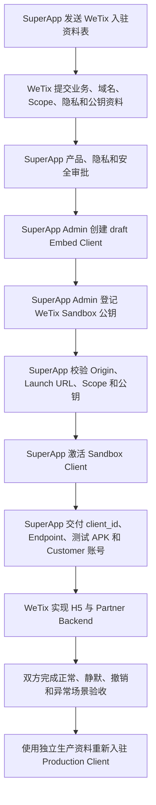

# WeTix Partner Embed SSO 前期入驻与联调准备

> 版本：v1.0  
> 日期：2026-08-20  
> 接入模式：Partner H5 无 JavaScript SDK + Partner Backend 无服务端 SDK  
> 当前 Sandbox Launch URL：`https://sb.wetix.my/`

本文用于 WeTix 正式开始开发前的信息收集、SuperApp 后台入驻、联调材料交付和准入验收。
具体 H5/Partner Backend 实现方式沿用《WeTix H5 无 SDK SSO 接入说明 v1.0》。本文不要求
WeTix 向 SuperApp 提供私钥。

## 1. 当前已知信息

| 项目 | 当前状态 |
| --- | --- |
| Partner 名称 | WeTix |
| 接入形态 | SuperApp 内嵌 Partner H5 |
| JavaScript SDK | 不使用，H5 直接调用 `SuperappNativeBridge` |
| 服务端 SDK | 不使用，WeTix Backend 自行实现 OAuth、PKCE 和 `private_key_jwt` |
| Sandbox Origin | `https://sb.wetix.my` |
| Sandbox Launch URL | `https://sb.wetix.my/` |
| 建议初始 Scope | `auth_base`、`profile.name`、`profile.avatar`，待业务和隐私审批 |
| Bridge 能力 | 当前由 SuperApp 固定提供 `getAuthCode`、`openPrivacySettings`、`close` |
| Sandbox Client ID | 待 SuperApp 创建后提供 |
| 生产 Origin / Launch URL | 待 WeTix 提供 |
| 法律主体、隐私政策、公钥 | 待 WeTix 提供 |

注意：

- Origin 是 `scheme + host + port`，不能包含 Path、Query、Fragment，且不能带尾部 `/`；
- Launch URL 是完整页面地址，可以包含 Path；
- 当前后台创建 Client 时只接受一个初始 Origin，因此 Sandbox 和 Production 必须分别创建
  Client，不能共用 Client ID、Origin 或密钥。

## 2. 前期接入流程



建议按以下顺序推进：

1. WeTix 先提交第 3 章资料，不完整时不创建正式 Client；
2. SuperApp 确认最小 Scope、数据用途和 Consent 文案；
3. WeTix 在自己的安全环境生成 Sandbox 私钥，只提交公钥 JWK；
4. SuperApp 创建并激活 Sandbox Client；
5. SuperApp 把 Sandbox 联调材料交给 WeTix；
6. WeTix 完成 `/api/sso/session`、`/api/sso/bootstrap`、`/api/sso/complete` 和无 SDK H5；
7. 双方使用测试 APK 完成端到端验收；
8. Sandbox 验收通过后，Production 使用独立域名、Client ID 和密钥重新走审批及入驻。

## 3. WeTix 需要提供的资料

### 3.1 必须提供：业务与主体资料

| 字段 | WeTix 需要提供的内容 | 用途 |
| --- | --- | --- |
| `display_name` | 用户可见名称，建议 `WeTix` | 金刚位、WebView 标题和 Consent 页面展示 |
| `legal_entity` | 承担数据处理责任的完整注册法律主体名称 | 签约、隐私和安全审批 |
| 业务说明 | 在 SuperApp 中提供的具体服务，例如票务查询、购票、订单管理 | 判断 Scope 和风险等级 |
| 数据用途 | 每个申请字段的具体用途、保存期限和删除方式 | Scope 与隐私审批 |
| 账号模式 | `auto_provision` 或 `explicit_bind` | 决定首次 SSO 后自动建号还是绑定既有 WeTix 账号 |
| 业务负责人 | 姓名、邮箱、电话 | 业务确认与上线审批 |
| 技术负责人 | 姓名、邮箱、电话、时区 | 联调和故障处理 |
| 安全/应急联系人 | 7×24 或约定服务时间内可联系人员 | 密钥泄漏、Token 异常和紧急下线 |

账号模式建议：

- `auto_provision`：使用 SuperApp `open_id` 自动创建或关联 WeTix 用户，接入体验最顺；
- `explicit_bind`：必须先绑定现有 WeTix 账号，只在业务明确要求保留既有账号体系时使用。

当前建议先使用 `auto_provision`，最终由 WeTix 产品和账号团队确认。

### 3.2 必须提供：每个环境的 H5 地址

WeTix 应分别提交 Sandbox 和 Production：

| 字段 | Sandbox 当前值 | Production |
| --- | --- | --- |
| Origin | `https://sb.wetix.my` | 待提供，例如 `https://app.wetix.my` |
| Launch URL | `https://sb.wetix.my/` | 待提供 |
| 隐私政策 URL | 待提供 | 待提供 |
| 其他导航域名 | 待提供 | 待提供 |

要求：

- 所有地址使用公网 HTTPS 和有效证书；
- Origin 禁止通配符、IP 地址、UserInfo、Path、Query 和 Fragment；
- Launch URL 必须与 Origin 使用相同 Host 和 Port；
- 隐私政策 URL 必须是稳定可访问的 HTTPS 页面，不能依赖登录态；
- WeTix 应列出登录后可能跳转的支付、帮助、CDN 或其他域名；这些域名不会自动获得 Bridge；
- Production 不能复用 Sandbox Client ID 或密钥。

### 3.3 必须提供：Scope 申请及数据用途

当前 SuperApp V1 支持：

| Scope | 返回资料 | WeTix 是否申请 | 需要 WeTix 说明 |
| --- | --- | --- | --- |
| `auth_base` | WeTix 隔离的 `open_id` | 必须 | 登录、账号创建或绑定方式 |
| `profile.name` | `display_name` | 建议 | 页面称呼、订单展示等具体用途 |
| `profile.avatar` | `avatar_url` | 建议 | 头像展示的具体页面和保存策略 |
| `contact.phone` | 已验证手机号 | 待确认 | 为什么 `open_id` 不足以完成业务 |
| `contact.email` | 已验证邮箱 | 待确认 | 邮件通知用途、退订和保存期限 |
| `kyc.status` | KYC 状态 | 默认不申请 | 只有受监管业务必要时申请并单独审批 |

建议 Sandbox 第一阶段只申请：

```json
[
  "auth_base",
  "profile.name",
  "profile.avatar"
]
```

如果 WeTix 只需要识别用户，最小化方案可以仅申请 `auth_base`。手机号、邮箱和 KYC 不应因为
“以后可能使用”而提前申请。

### 3.4 必须提供：Partner 公钥

WeTix 必须在自己的 Backend 安全环境生成每个环境独立的签名密钥：

- 推荐算法：`ES256`；
- 曲线：P-256；
- 私钥：只保存在 WeTix 的 KMS、HSM 或 Secret Manager；
- SuperApp 只接收公钥 JWK；
- Sandbox 和 Production 使用不同密钥；
- 每把密钥需要唯一 `kid`、`not_before` 和 `expires_at`；
- 建议在旧密钥到期前至少 7 天登记新密钥并保留短期重叠。

WeTix 提交的公钥资料示例：

```json
{
  "kid": "wetix-sandbox-es256-2026-01",
  "alg": "ES256",
  "public_jwk": {
    "kty": "EC",
    "crv": "P-256",
    "x": "<base64url-x-coordinate>",
    "y": "<base64url-y-coordinate>",
    "use": "sig",
    "alg": "ES256",
    "kid": "wetix-sandbox-es256-2026-01"
  },
  "not_before": "2026-08-20T00:00:00Z",
  "expires_at": "2027-08-20T00:00:00Z"
}
```

`public_jwk` 中禁止出现 EC 私钥参数 `d`。如果 WeTix 提交 PEM 公钥，SuperApp 入驻前仍需
转换并校验为只包含公钥参数的 JWK；推荐 WeTix 直接交付最终 JWK，减少转换歧义。

### 3.5 必须提供：Partner Backend 契约确认

WeTix 需要确认：

- H5 实际调用的 `/api/sso/session` 路径和响应；
- `/api/sso/bootstrap` 路径、事务 TTL、`state` 与 PKCE 生成方式；
- `/api/sso/complete` 路径、一次性事务消费和 Session 建立方式；
- Partner Session Cookie 名称、Domain、`Secure`、`HttpOnly`、`SameSite` 和 TTL；
- Access Token 到期前自动 Refresh 的策略；
- Consent 撤销或 Token 失效后清理 Partner Session 的方式；
- WeTix `open_id` 与现有用户账号的映射或绑定规则；
- 日志脱敏、审计保留和事故响应方式。

建议 WeTix H5 与 Partner Backend 使用同一 Origin，避免 CORS 和第三方 Cookie 问题。

### 3.6 单独交付：App 展示素材

以下信息当前不在 Embed Client 创建 API 请求体中，但 SuperApp App 金刚位和运营配置仍可能
需要单独收集：

- WeTix Logo 原始矢量文件及 Android/iOS 所需尺寸；
- 金刚位展示名称和多语言文案；
- 服务简介；
- 客服与问题反馈入口；
- 上线地区、用户范围和灰度计划。

## 4. 可直接发给 WeTix 的资料回收表

```text
【WeTix Embed SSO 入驻资料】

一、主体与联系人
1. 用户可见名称：
2. 完整注册法律主体：
3. 业务说明：
4. 账号模式：auto_provision / explicit_bind
5. 业务负责人（姓名/邮箱/电话）：
6. 技术负责人（姓名/邮箱/电话/时区）：
7. 安全与应急联系人：

二、Sandbox
1. Origin：https://sb.wetix.my
2. Launch URL：https://sb.wetix.my/
3. 隐私政策 URL：
4. 其他可能导航域名：

三、Production
1. Origin：
2. Launch URL：
3. 隐私政策 URL：
4. 其他可能导航域名：

四、Scope 与用途
1. auth_base 用途：
2. profile.name 是否申请及用途：
3. profile.avatar 是否申请及用途：
4. contact.phone 是否申请、必要性及保存期限：
5. contact.email 是否申请、必要性及保存期限：
6. kyc.status 是否申请及合规依据：

五、Sandbox 公钥
1. kid：
2. alg（推荐 ES256）：
3. public_jwk：
4. not_before（UTC）：
5. expires_at（UTC）：

六、Partner Backend
1. session/bootstrap/complete 实际接口路径：
2. Partner Session Cookie 策略与 TTL：
3. open_id 账号映射策略：
4. Access/Refresh Token 加密存储和轮换方案：
5. Consent 撤销后的 Session 清理方案：

七、App 素材
1. Logo：
2. 金刚位名称及多语言：
3. 服务简介：
4. 客服/反馈入口：
```

## 5. SuperApp 内部审批结论

收到资料后，SuperApp 需要先形成书面审批结果：

| 审批项 | Sandbox 建议 | 最终结果 |
| --- | --- | --- |
| `display_name` | `WeTix` | 待确认 |
| `legal_entity` | 由 WeTix 提供 | 待确认 |
| `risk_tier` | `standard` | 待安全审批 |
| `account_mode` | `auto_provision` | 待业务确认 |
| `allowed_scopes` | `auth_base profile.name profile.avatar` | 待隐私审批 |
| `privacy_policy_url` | 由 WeTix 提供 | 待确认 |
| `origin` | `https://sb.wetix.my` | 已知，待域名归属校验 |
| `launch_url` | `https://sb.wetix.my/` | 已知，待页面验收 |
| 公钥 | WeTix 提交 ES256 Public JWK | 待安全校验 |

Client 激活前至少完成：

- 法律主体和联系人确认；
- Origin/Launch URL 的 HTTPS、域名归属和页面内容检查；
- 隐私政策页面检查；
- Scope 最小化和数据用途审批；
- Public JWK 算法、`kid`、有效期和无私钥材料校验；
- Sandbox 与 Production 环境隔离确认。

## 6. SuperApp 后台入驻请求

### 6.1 请求前准备

下面请求由 **SuperApp 管理员**执行，不交给 WeTix 执行。需要：

```bash
export SUPERAPP_BASE_URL='https://<superapp-admin-api-host>'
# 由 SuperApp 的 Secret Manager 或受控会话注入，不在命令中填写明文 Token。
: "${SUPERAPP_ADMIN_TOKEN:?SUPERAPP_ADMIN_TOKEN is required}"
```

Admin Token 不应写入脚本、文档、Shell History、工单或聊天记录。下面所有请求都建议使用
一次性的安全 Shell 环境执行。

如果尚未取得 Admin Token，由有权限的 SuperApp 管理员通过独立认证流程登录：

```http
POST /api/admin/v1/auth/login
```

不应把管理员账号或密码提供给 WeTix。

### 6.2 第一步：创建 Sandbox draft Client

只有在第 5 章审批完成后才能执行。当前建议请求：

```bash
curl --fail-with-body --silent --show-error \
  --request POST \
  "$SUPERAPP_BASE_URL/api/admin/v1/embed/clients" \
  --header "Authorization: Bearer $SUPERAPP_ADMIN_TOKEN" \
  --header 'Content-Type: application/json' \
  --header 'Accept: application/json, application/problem+json' \
  --data-binary @- <<'JSON' | jq .
{
  "display_name": "WeTix",
  "legal_entity": "<WETIX_REGISTERED_LEGAL_ENTITY>",
  "risk_tier": "standard",
  "account_mode": "auto_provision",
  "allowed_scopes": [
    "auth_base",
    "profile.name",
    "profile.avatar"
  ],
  "privacy_policy_url": "<WETIX_SANDBOX_PRIVACY_POLICY_HTTPS_URL>",
  "origin": "https://sb.wetix.my",
  "launch_url": "https://sb.wetix.my/"
}
JSON
```

预期响应：

```json
{
  "client_id": "embcli_xxx",
  "status": "draft",
  "consent_version": 1
}
```

记录返回的 `client_id`。此时 Client 仍是 `draft`，不能签发 Launch Manifest 或
Authorization Code。

不要把 Origin 写成 `https://sb.wetix.my/`。Origin 带 `/` 会因为不再是精确 Origin 而被拒绝。

### 6.3 第二步：登记 WeTix Sandbox 公钥

把 WeTix 交付的 Public JWK 保存为受控临时文件，例如：

```text
wetix-sandbox-public.jwk.json
```

文件中只能包含公钥。先检查不存在 EC 私钥字段 `d`：

```bash
jq 'has("d") | not' wetix-sandbox-public.jwk.json
```

预期输出为 `true`。

使用第一步返回的 `client_id`：

```bash
export WETIX_CLIENT_ID='embcli_xxx'
export WETIX_KEY_ID='wetix-sandbox-es256-2026-01'
```

登记请求：

```bash
jq -n \
  --arg kid "$WETIX_KEY_ID" \
  --arg alg 'ES256' \
  --arg not_before '2026-08-20T00:00:00Z' \
  --arg expires_at '2027-08-20T00:00:00Z' \
  --slurpfile public_jwk wetix-sandbox-public.jwk.json \
  '{
    kid: $kid,
    alg: $alg,
    public_jwk: $public_jwk[0],
    not_before: $not_before,
    expires_at: $expires_at
  }' |
curl --fail-with-body --silent --show-error \
  --request POST \
  "$SUPERAPP_BASE_URL/api/admin/v1/embed/clients/$WETIX_CLIENT_ID/keys" \
  --header "Authorization: Bearer $SUPERAPP_ADMIN_TOKEN" \
  --header 'Content-Type: application/json' \
  --header 'Accept: application/json, application/problem+json' \
  --data-binary @- | jq .
```

`not_before` 和 `expires_at` 必须替换为 WeTix 实际提交且已审批的 UTC 时间。激活时至少要有
一把已经到达 `not_before` 且尚未到达 `expires_at` 的有效公钥。

预期响应：

```json
{
  "key_id": "embkey_xxx",
  "kid": "wetix-sandbox-es256-2026-01",
  "expires_at": "2027-08-20T00:00:00Z"
}
```

`key_id` 是 SuperApp 内部公钥记录 ID；WeTix 在 Client Assertion Header 中使用的是自己提交的
`kid`。

### 6.4 第三步：激活 Sandbox Client

激活前再次核对：

- Client 仍为 `draft`；
- Origin 和 Launch URL 正确；
- Scope 审批结果与创建请求一致；
- 隐私政策可访问；
- 至少一把 Public JWK 当前有效；
- WeTix 私钥没有发送给 SuperApp。

激活请求：

```bash
curl --fail-with-body --silent --show-error \
  --request POST \
  "$SUPERAPP_BASE_URL/api/admin/v1/embed/clients/$WETIX_CLIENT_ID/activate" \
  --header "Authorization: Bearer $SUPERAPP_ADMIN_TOKEN" \
  --header 'Accept: application/json, application/problem+json' | jq .
```

预期为 2xx 成功响应。激活接口会再次检查 Client 至少存在一个 active Origin 和一把当前有效
公钥；不满足条件时不能激活。

### 6.5 激活后的只读验证

检查 SuperApp Embed Discovery：

```bash
curl --fail-with-body --silent --show-error \
  "$SUPERAPP_BASE_URL/.well-known/superapp-embed-configuration" | jq .
```

检查 SuperApp Launch Manifest JWKS：

```bash
curl --fail-with-body --silent --show-error \
  "$SUPERAPP_BASE_URL/.well-known/jwks.json" | jq .
```

然后使用安装了可信 Native Bridge 的测试 APK 和 Customer 测试账号，从 WeTix 金刚位请求：

```http
GET /api/customer/v1/embed/apps/{WETIX_CLIENT_ID}/launch-manifest
Authorization: Bearer <customer-token>
```

确认返回：

- `client_id` 等于新建的 WeTix Client ID；
- `display_name` 为 `WeTix`；
- `origin` 为 `https://sb.wetix.my`；
- `launch_url` 为 `https://sb.wetix.my/`；
- `capabilities` 为 `getAuthCode`、`openPrivacySettings`、`close`；
- Android/iOS 客户端能验证 `signed_payload`；
- WebView 只对 WeTix Sandbox Origin 注入 Bridge。

## 7. SuperApp 需要交付给 WeTix

Sandbox Client 激活后，SuperApp 应向 WeTix 安全交付：

| 交付项 | 内容 |
| --- | --- |
| Client ID | Sandbox `embcli_xxx` |
| 已批准 Scope | 最终审批后的完整清单 |
| SuperApp Base URL | Sandbox API Base URL |
| Discovery URL | `/.well-known/superapp-embed-configuration` |
| Token Endpoint | Discovery 返回的完整 URL |
| UserInfo Endpoint | Discovery 返回的完整 URL |
| Revoke Endpoint | Discovery 返回的完整 URL |
| Client 认证方式 | `private_key_jwt` |
| 已登记 Key | WeTix 的 `kid`、算法和有效期确认，不包含私钥 |
| Bridge 契约 | `getContext`、`getAuthCode`、`openPrivacySettings`、`close` |
| 测试客户端 | 安装了受信 Bridge 的联调 APK |
| Customer 测试账号 | 通过安全渠道单独交付 |
| 错误码和联调窗口 | 稳定错误码、双方联系人和联调时间 |

SuperApp 不向 WeTix 提供：

- Customer Token；
- SuperApp Manifest 签名私钥；
- 其他 Partner 的 Client ID、Origin、公钥或用户数据；
- Admin Token 或管理员账号密码。

## 8. WeTix 开发启动条件

以下条件满足后，WeTix 才能开始完整端到端联调：

- [ ] 收到 Sandbox Client ID；
- [ ] 收到 Sandbox SuperApp Base URL 和 Discovery URL；
- [ ] WeTix Sandbox Public JWK 已登记且 Client 已激活；
- [ ] 确认最终 Sandbox Scope；
- [ ] 测试 APK 能打开 `https://sb.wetix.my/` 并注入 Bridge；
- [ ] WeTix H5 已配置期望的 Sandbox Client ID；
- [ ] WeTix Backend 可访问 SuperApp Token/UserInfo/Revoke Endpoint；
- [ ] WeTix Backend 已安全持有匹配 `kid` 的私钥；
- [ ] 双方有可用的 Customer 测试账号和联调联系人。

## 9. 分阶段联调与验收

### 阶段一：容器与 Bridge

- [ ] 金刚位打开正确 WeTix Sandbox H5；
- [ ] `getContext` 返回正确 `client_id`、`container`、版本和 capabilities；
- [ ] 普通浏览器访问时不会伪造登录；
- [ ] 非 WeTix Origin 和 iframe 不能使用敏感 Bridge。

### 阶段二：首次 SSO

- [ ] `/api/sso/session` 无 Session 时返回稳定 401；
- [ ] `/api/sso/bootstrap` 生成短期一次性事务、随机 `state` 和 S256 challenge；
- [ ] 首次 Scope 申请显示 SuperApp 原生 Consent；
- [ ] 拒绝授权时 H5 正确处理 `consent_denied`；
- [ ] 同意后 Code 只提交给 WeTix Backend；
- [ ] WeTix Backend 使用 `private_key_jwt`、Code 和 verifier 成功换 Token；
- [ ] UserInfo 只返回已批准并由 Customer 同意的资料；
- [ ] WeTix 建立自己的 Partner Session，H5 不接触 Token。

### 阶段三：再次打开与撤销

- [ ] Partner Session 有效时直接进入 WeTix 业务页；
- [ ] Partner Session 丢失但 Consent 有效时静默 SSO，无授权弹窗；
- [ ] `openPrivacySettings` 能显示 WeTix 授权；
- [ ] Customer 撤销 Consent 后 WeTix Token 失效；
- [ ] 撤销后再次进入必须重新显示 Consent。

### 阶段四：安全和异常

- [ ] 修改 `state`、PKCE challenge、Client ID 或 Scope 后失败；
- [ ] transaction 和 Authorization Code 重放失败；
- [ ] `private_key_jwt` 的 `jti` 重放失败；
- [ ] 过期 Manifest、Code、Assertion、Access Token 和 Refresh Token 均按契约失败；
- [ ] 错误日志不包含私钥、Assertion、Code、Token、verifier 或完整敏感用户资料；
- [ ] 网络失败、5xx 和超时不会降级为向 H5 暴露 Customer Token。

## 10. Production 入驻

Sandbox 通过不代表 Production 自动开通。Production 必须重新提交并审批：

- Production 法律主体和隐私政策；
- Production 精确 Origin 和 Launch URL；
- Production 最小 Scope；
- Production 独立 Public JWK、`kid` 和有效期；
- Production 账号模式、风险等级和数据保留策略；
- 上线时间、灰度范围、回滚和紧急下线方案。

Production 重复执行以下三个 Admin 请求，但使用独立数据：

```text
POST /api/admin/v1/embed/clients
POST /api/admin/v1/embed/clients/{production_client_id}/keys
POST /api/admin/v1/embed/clients/{production_client_id}/activate
```

禁止把 Sandbox Client ID、私钥、公钥登记、Cookie、测试账号或调试配置直接复制到生产环境。

## 11. 当前阻塞项

创建 Sandbox draft Client 前必须确认：

1. WeTix 完整注册法律主体；
2. Sandbox 隐私政策 HTTPS URL；
3. 最终 Sandbox Scope 及逐项数据用途；
4. `auto_provision` 或 `explicit_bind` 的账号模式；
5. 技术负责人和安全应急联系人。

Sandbox Client 激活前还必须补齐：

1. Sandbox ES256 Public JWK、`kid`、`not_before`、`expires_at`；
2. Partner Session Cookie 和三个 SSO 接口的最终契约；
3. Sandbox 页面和 Bridge 容器的基础检查；
4. Scope、隐私政策和公钥的最终审批结论。

Production Origin、Launch URL、隐私政策和生产公钥可以在 Sandbox 联调期间补充，但必须在
Production 入驻前完成独立审批。
